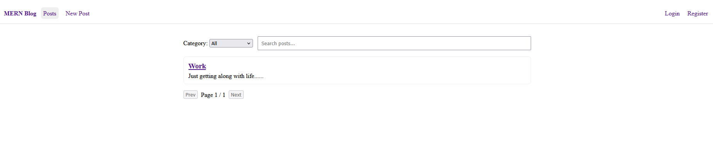

# MERN Blog

Full‑stack MERN (MongoDB, Express.js, React, Node.js) blog demonstrating clean integration between a REST API and a Vite React client with routing, authentication, validation, and stateful UI.

## Project Overview

The application provides:
1. RESTful API for posts, categories, and authentication
2. React front‑end (Vite) with routing, guarded routes, and forms
3. CRUD for blog posts with category filtering, search, and pagination
4. JWT‑based authentication (register, login) with protected create/edit
5. Server‑side validation and structured error handling

## Project Structure

```
mern-blog/
├── client/                 # React front-end
│   ├── public/             # Static files
│   ├── src/                # React source code
│   │   ├── components/     # Reusable components
│   │   ├── pages/          # Page components
│   │   ├── hooks/          # Custom React hooks
│   │   ├── services/       # API services
│   │   ├── context/        # React context providers
│   │   └── App.jsx         # Main application component
│   └── package.json        # Client dependencies
├── server/                 # Express.js back-end
│   ├── config/             # Configuration files
│   ├── controllers/        # Route controllers
│   ├── models/             # Mongoose models
│   ├── routes/             # API routes
│   ├── middleware/         # Custom middleware
│   ├── utils/              # Utility functions
│   ├── server.js           # Main server file
│   └── package.json        # Server dependencies
└── README.md               # Project documentation
```

## Setup Instructions

1. Prerequisites
   - Node.js v18+
   - MongoDB (local or Atlas)

2. Environment variables
   - Create `server/.env` with:
     - `PORT=5000`
     - `MONGODB_URI=mongodb://27017/
     - `NODE_ENV=development`
     - `JWT_SECRET=dev_secret_change_me`
   - Optionally create `client/.env` with:
     - `VITE_API_URL=http://localhost:5000/api`

3. Install and run
   - Server
     - `cd server`
     - `npm install`
     - `npm run dev`
   - Client
     - Open a new terminal
     - `cd client`
     - `npm install`
     - `npm run dev`


## API Documentation

Base URL: `/api`

Auth
- `POST /api/auth/register` — body: `{ name, email, password }`
- `POST /api/auth/login` — body: `{ email, password }` — returns `{ token, user }`

Posts
- `GET /api/posts?page=1&limit=10&category=:categoryId` — list with pagination
- `GET /api/posts/:idOrSlug` — single post by id or slug
- `POST /api/posts` — protected — body: `{ title, content, category, tags?, featuredImage?, excerpt?, isPublished? }`
- `PUT /api/posts/:id` — protected — update fields above
- `DELETE /api/posts/:id` — protected
- `POST /api/posts/:id/comments` — protected — body: `{ content }`
- `GET /api/posts/search?q=term` — search by title/content/excerpt

Categories
- `GET /api/categories` — list
- `POST /api/categories` — protected(admin)
- `GET /api/categories/:id`
- `PUT /api/categories/:id` — protected(admin)
- `DELETE /api/categories/:id` — protected(admin)

## Features Implemented

- JWT authentication (register/login)
- Protected routes on client and server (create/edit/delete posts)
- Posts CRUD with validation
- Category filtering, search (debounced), and pagination on list view
- Request/response interceptors on client for auth handling
- Error handling middleware on server

## Screenshot



## Resources

- [MongoDB Documentation](https://docs.mongodb.com/)
- [Express.js Documentation](https://expressjs.com/)
- [React Documentation](https://react.dev/)
- [Node.js Documentation](https://nodejs.org/en/docs/)
- [Mongoose Documentation](https://mongoosejs.com/docs/) 